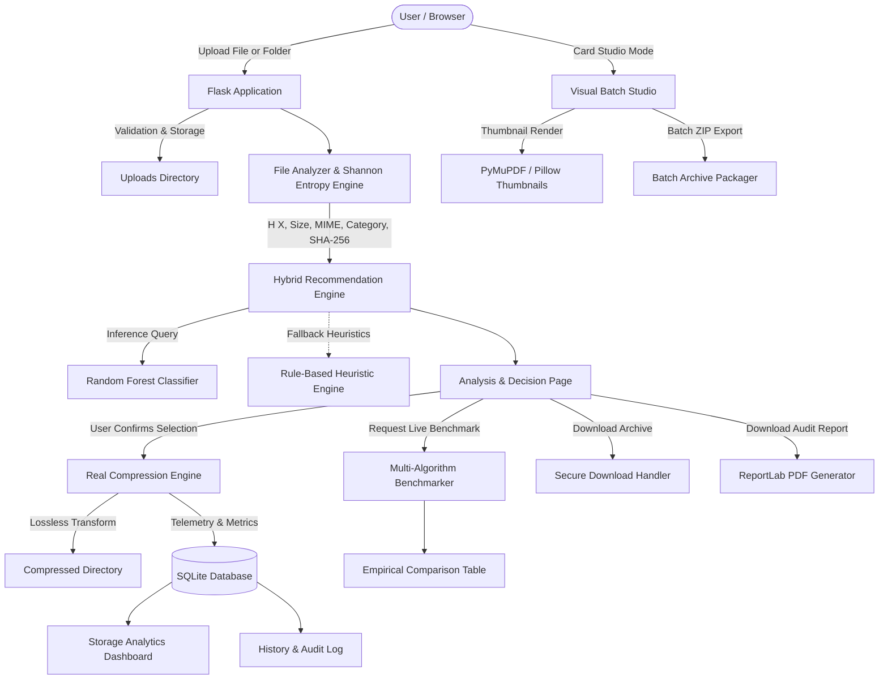

# SmartCompress AI: Intelligent File Compression Recommendation System
> **An Information Storage Management (ISM) Academic Research & Production Project**


---

## 1. Executive Summary & ISM Relevance

In modern enterprise data centers, storage infrastructure is governed by the **Information Storage Management (ISM)** lifecycle. Uncompressed raw data consumes massive physical capacities across Primary Storage Area Networks (SAN), Network Attached Storage (NAS), and cloud object tiers, resulting in escalating operational expenditures (OPEX) and network transfer bottlenecks.

However, data reduction cannot be applied blindly:
1. **CPU/Latency Trade-off:** High-density algorithms (e.g., LZMA2, 7Z) require orders of magnitude more CPU cycles and memory than lightweight algorithms (e.g., Deflate, GZIP).
2. **Entropy Limits:** Payloads that are already compressed (e.g., JPEG, MP4, encrypted volumes) exhibit near-maximal Shannon entropy ($\approx 8.0\text{ bits/byte}$). Applying compression to high-entropy files causes **negative space savings** due to container overhead.
3. **Lossless Requirement:** Enterprise databases, source code, document repositories, and binaries require **100% mathematical bit-for-bit reconstruction**.

**SmartCompress AI** bridges information theory and practical storage engineering. It calculates the byte-level Shannon entropy of incoming files, feeds empirical characteristics into a trained **Random Forest Machine Learning Classifier**, recommends the optimal compression strategy based on user objectives, performs **real lossless compression** across 6 distinct algorithms (PDF-Deflate, ZIP, GZIP, BZIP2, LZMA, 7Z), audits savings in SQLite, provides visual card-based multi-file batch studio processing, and generates downloadable archival reports in PDF format.

---

## 2. Key Capabilities & System Features

- **Empirical Shannon Entropy Engine:** Calculates discrete byte frequency distributions $H(X) = -\sum_{i=0}^{255} p(i)\log_2 p(i)$ using chunked streaming buffers (handles multi-megabyte payloads without memory exhaustion).
- **Hybrid Recommendation Architecture:**
  - **Random Forest ML Engine:** Trained strictly on real measured benchmark runs across representative corpus samples.
  - **Deterministic Rule-Based Fallback:** Ensures high-availability recommendations even if the ML model is missing or uncalibrated.
- **Genuine Lossless & Document Compression Suite:**
  - **PDF-Deflate:** In-depth stream and object deflation optimization for PDF documents preserving vector rendering and text fidelity.
  - **ZIP:** Deflate algorithm via Python `zipfile`, preserving metadata and folder hierarchies.
  - **GZIP:** GNU Zip stream with header preservation (`.tar.gz` for folders).
  - **BZIP2:** Burrows-Wheeler block sorting via `bz2` (`.tar.bz2` for folders).
  - **LZMA / XZ:** Lempel-Ziv-Markov chain algorithm (`.tar.xz` for folders).
  - **7Z:** LZMA2 high-dictionary compression via `py7zr`.
- **Card-Based Visual Multi-File Batch Studio:**
  - Visual multi-file queuing with real-time thumbnail rendering for PDFs and images (via PyMuPDF & Pillow).
  - Granular compression intensity sliders (0% – 100%).
  - Per-card algorithm selection or automated ML auto-recommendation.
  - Single-click package compilation into a consolidated Batch ZIP archive.
- **Full Folder & Directory Upload Support:**
  - Upload entire directory trees via `webkitdirectory`.
  - Recursive Shannon entropy aggregation and folder structure preservation.
- **Live Empirical Benchmarking:** Allows users to benchmark algorithms simultaneously on uploaded files, measuring compressed size, space saved, compression time, and throughput (MB/s).
- **Enterprise Storage Analytics Dashboard:** Aggregates real SQLite telemetry into live Chart.js visualizations (algorithm usage distribution, category savings, net storage reclaimed).
- **Auditing & PDF Reports:** Generates publication-ready technical reports using ReportLab with SHA-256 hashes, entropy interpretations, and comparison charts.
- **Persistent SQLite History:** Fully searchable, filterable, sortable, and paginated ledger with CSV export and safe record deletion.
- **PWA & Mobile Support:** Responsive interface with Web App Manifest (`manifest.json`) and Service Worker (`service-worker.js`).
- **Enterprise Security:** Path traversal protection, Werkzeug filename sanitization, UUID operation namespaces, and automated retention cleanup.

---

## 3. System Architecture & Workflow



---

## 4. Mathematical Information Theory: Shannon Entropy

Shannon entropy measures the average information density and unpredictability in a discrete random variable:

$$H(X) = -\sum_{i=0}^{255} p(x_i) \log_2 p(x_i)$$

Where:
- $X$ represents the byte stream of the file.
- $x_i \in [0, 255]$ represents the 256 possible byte values.
- $p(x_i) = \frac{\text{count}(x_i)}{\text{total bytes}}$ is the probability of byte $x_i$ occurring.
- $H(X)$ is bounded between $0.0$ and $8.0$ bits per byte.

### Interpretive Scale in SmartCompress AI:
| Entropy Range (bits/byte) | Data Randomness | Typical File Types | Compressibility Potential | Recommended Algorithm Strategy |
|---|---|---|---|---|
| **0.0 - 3.0** | Extremely Low | Sparse binaries, repetitive logs, DNA sequences | **Huge (70% - 95%)** | Deflate (ZIP/GZIP), BZIP2 |
| **3.0 - 6.0** | Moderate | Source code, JSON, CSV, text, XML, markdown | **High (50% - 80%)** | BZIP2, 7Z, ZIP |
| **6.0 - 7.5** | High | Compiled machine code, uncompressed raw audio/bitmaps, complex PDFs | **Modest (10% - 30%)** | LZMA, 7Z, PDF-Deflate |
| **7.5 - 8.0** | Near-Maximal | JPEGs, MP4s, encrypted volumes, pre-compressed ZIPs | **Incompressible (< 5% or Negative)** | Containerize only without heavy CPU |

---

## 5. Compression Algorithms Technical Comparison

| Algorithm | Foundation | Typical Ratio | CPU Cost | Decompression Speed | Best Suited For |
|---|---|---|---|---|---|
| **PDF-Deflate** | FlateDecode / Object Stream Deflation | High (30-70% on raw PDFs) | Low | Fast | PDF documents with embedded uncompressed streams |
| **ZIP** | Deflate (LZ77 + Huffman) | Moderate (50-70%) | Low | Fast | Ubiquitous compatibility, multi-platform sharing |
| **GZIP** | Deflate Stream | Moderate (50-70%) | Very Low | Ultra-fast | Web streaming, HTTP transfer, log rotation |
| **BZIP2** | Burrows-Wheeler Transform + RLE + Huffman | High (60-80%) | Moderate | Moderate | Text, structured database dumps, repetitive tables |
| **LZMA** | Lempel-Ziv-Markov chain Algorithm | Very High (70-85%) | High | Fast | Operating system packages, kernel images, binaries |
| **7Z** | LZMA2 + Dynamic Sliding Window | Maximum (75-90%) | High | Fast | Maximum storage reclamation, archival tiers |

---

## 6. Machine Learning Pipeline & Dataset Generation

### Empirical Training Pipeline
Unlike naive implementations that map extensions directly to hardcoded rules, SmartCompress AI employs an **empirical training pipeline**:

1. **Representative Corpus Generation:** Creates 17 diverse sample files covering low entropy, structured text, source code, tabular CSVs, mixed binaries, and incompressible random data.
2. **Exhaustive Experimental Runs:** Executes algorithms on every sample, measuring exact output size, bytes saved, space saving percentage, and elapsed execution time.
3. **Objective Evaluation Function:**
   - **Maximum Compression Mode:** Selects the algorithm achieving the highest space saving percentage.
   - **Fastest Mode:** Selects the algorithm with minimum compression duration among positive space-saving runs.
   - **Balanced Mode:** Optimizes multi-objective score:
     $$\text{Score} = \text{SavingPct} - (\lambda \times \text{DurationSeconds})$$
4. **Model Architecture:**
   - Preprocessing: `StandardScaler` for numeric features (`file_size`, `entropy`), `OneHotEncoder(handle_unknown='ignore')` for categorical features (`category`, `extension`, `preference`).
   - Classifier: `RandomForestClassifier(n_estimators=100, max_depth=12, random_state=42, class_weight='balanced')`.
   - Serialization: Serialized with metadata into `model/saved_model.joblib`.

---

## 7. Project Structure

```
SmartCompressAI/
│
├── app.py                      # Flask main entry point & route controllers
├── config.py                   # Central configuration & runtime paths
├── requirements.txt            # Python package dependencies
├── README.md                   # Comprehensive project documentation
├── .env.example                # Sample environment configuration
├── .gitignore                  # Git ignore rules
│
├── database/                   # SQLite database access layer
│   ├── __init__.py
│   ├── db.py                   # Parameterized queries, schema, and statistics
│   └── database.db             # Auto-generated SQLite database (git-ignored)
│
├── utils/                      # Core mathematical and security utilities
│   ├── __init__.py
│   ├── analyzer.py             # Metadata extraction, categorization, SHA-256
│   ├── entropy.py              # Shannon entropy calculator & interpretation
│   ├── validators.py           # Path traversal protection, file validation
│   └── cleanup.py              # Temporary file retention cleanup utility
│
├── engines/                    # Algorithmic engines
│   ├── __init__.py
│   ├── compression_engine.py   # Lossless compression (ZIP, GZIP, BZIP2, LZMA, 7Z, PDF-Deflate)
│   ├── recommendation_engine.py# Deterministic rule-based recommender
│   └── ml_engine.py            # Hybrid ML decision manager with fallback
│
├── services/                   # Application service layer
│   ├── __init__.py
│   ├── analysis_service.py     # Upload orchestration & state persistence
│   ├── batch_compressor_service.py # Visual multi-file studio, thumbnails & batch ZIP
│   ├── compression_service.py  # Compression execution & live benchmarking
│   ├── history_service.py      # History queries, filtering, pagination, CSV
│   └── report_service.py       # ReportLab PDF technical report generator
│
├── model/                      # Machine learning artifacts
│   ├── __init__.py
│   ├── train_model.py          # Random Forest training & evaluation script
│   ├── predictor.py            # Model inference & confidence scorer
│   ├── saved_model.joblib      # Serialized trained model pipeline
│   └── model_metrics.json      # Serialized test evaluation metrics
│
├── dataset/                    # Empirical training data
│   ├── __init__.py
│   ├── generate_dataset.py     # Benchmark data generator script
│   ├── compression_dataset.csv # Compiled training dataset
│   └── raw_benchmark_measurements.csv # Raw experimental runs
│
├── templates/                  # Jinja2 HTML5 responsive templates
│   ├── base.html               # Master layout, navigation, modals, PWA tags
│   ├── index.html              # Drag-and-drop upload & preference interface
│   ├── result.html             # Analysis, entropy gauge, compress, benchmarks
│   ├── history.html            # Searchable audit ledger with CSV export
│   ├── dashboard.html          # Storage telemetry & Chart.js visualizations
│   └── error.html              # Friendly error & offline fallback template
│
├── static/                     # Web assets
│   ├── css/
│   │   └── style.css           # Glassmorphism dark theme & animations
│   ├── js/
│   │   └── app.js              # Drag-drop handlers, AJAX benchmarks, PWA
│   ├── manifest.json           # Progressive Web App manifest
│   └── service-worker.js       # PWA offline cache service worker
│
├── uploads/                    # Temporary uploaded files (.gitkeep preserved)
├── compressed/                 # Output compressed archives (.gitkeep preserved)
├── reports/                    # Generated PDF reports (.gitkeep preserved)
└── tests/                      # Automated test suite (Pytest - 34 tests)
    ├── __init__.py
    ├── test_analyzer.py        # Entropy formula, edge cases, metadata
    ├── test_compression.py     # Real compression, roundtrip verification & folders
    ├── test_database.py        # SQLite queries, filtering, statistics
    └── test_routes.py          # Flask routes, batch studio API, benchmarks, downloads
```

---

## 8. Installation & Setup Guide

### Prerequisites
- Python 3.10 to 3.14 (Tested on Windows 10/11, macOS, and Linux).
- Git.

### Step 1: Clone or Open the Project
```bash
git clone https://github.com/your-username/SmartCompressAI.git
cd SmartCompressAI
```

### Step 2: Create and Activate Virtual Environment
**On Windows (PowerShell):**
```powershell
python -m venv .venv
.\.venv\Scripts\Activate.ps1
```

**On Windows (Command Prompt):**
```cmd
python -m venv .venv
.\.venv\Scripts\activate.bat
```

**On macOS / Linux:**
```bash
python3 -m venv .venv
source .venv/bin/activate
```

### Step 3: Install Dependencies
```bash
pip install -r requirements.txt
```

### Step 4: (Optional) Re-Generate Dataset & Retrain Model
The repository includes a ready-to-use pre-trained model. If you wish to re-benchmark and retrain:
```bash
python dataset/generate_dataset.py
python model/train_model.py
```

### Step 5: Run Automated Tests
```bash
python -m pytest tests/ -v
```
All **34 unit and integration tests** will pass with 100% green status.

### Step 6: Start the Web Application
```bash
python app.py
```
Open your browser and navigate to:
**http://127.0.0.1:5000**

---

## 9. API & Route Reference

| Endpoint | Method | Description |
|---|---|---|
| `/` | GET | Homepage with drag-and-drop file/folder upload & preference controls |
| `/analyze` | POST | Analyzes uploaded file/folder, computes Shannon entropy & predicts recommendation |
| `/result/<operation_id>` | GET | Results page displaying entropy gauge, file breakdown & compression options |
| `/compress/<operation_id>` | POST | Executes lossless compression with the chosen algorithm |
| `/api/benchmark/<operation_id>` | POST | Live multi-algorithm empirical benchmark returning speeds, sizes & ratios |
| `/download/<operation_id>` | GET | Securely streams the compressed archive file with traversal validation |
| `/download_report/<operation_id>` | GET | Generates and downloads the PDF technical audit report |
| `/dashboard` | GET | Storage analytics overview with interactive Chart.js telemetry |
| `/history` | GET | Searchable, paginated audit ledger of all compression events |
| `/history/delete/<id>` | POST | Securely removes a history entry from SQLite |
| `/export_history` | GET | Exports complete history as a CSV file |
| `/api/upload_file` | POST | Batch studio upload endpoint supporting multi-file queuing & thumbnailing |
| `/api/compress_file` | POST | Compresses an individual queued item with adjustable level slider |
| `/api/download_batch_zip` | POST | Bundles all batch-processed files into a single downloadable ZIP archive |
| `/api/delete_file/<operation_id>` | DELETE / POST | Cancels and removes a queued file from the workspace |

---

## 10. SQLite Database Schema

The database initializes automatically upon startup at `database/database.db`:

```sql
CREATE TABLE IF NOT EXISTS compression_history (
    id INTEGER PRIMARY KEY AUTOINCREMENT,
    operation_id TEXT UNIQUE NOT NULL,
    original_filename TEXT NOT NULL,
    file_extension TEXT,
    file_category TEXT,
    mime_type TEXT,
    entropy REAL,
    original_size INTEGER NOT NULL,
    compressed_size INTEGER NOT NULL,
    bytes_saved INTEGER NOT NULL,
    compression_ratio REAL NOT NULL,
    compression_duration REAL NOT NULL,
    selected_algorithm TEXT NOT NULL,
    recommendation_source TEXT,
    model_confidence REAL,
    output_filename TEXT NOT NULL,
    creation_timestamp TEXT NOT NULL,
    operation_status TEXT NOT NULL
);

CREATE INDEX IF NOT EXISTS idx_operation_id ON compression_history(operation_id);
CREATE INDEX IF NOT EXISTS idx_algorithm ON compression_history(selected_algorithm);
CREATE INDEX IF NOT EXISTS idx_creation_timestamp ON compression_history(creation_timestamp);
```

---

## 11. Security Considerations

1. **Path Traversal Mitigation:** All downloads strictly validate that requested files reside within approved directory parents using canonical `Path.resolve()` checks (`is_safe_path`).
2. **Filename Sanitization:** Uploaded filenames are scrubbed using Werkzeug's `secure_filename()` with fallback regex to remove directory traversal characters (`..`, `/`, `\`).
3. **Namespace Isolation:** Every upload and compression operation receives a unique UUID hexadecimal namespace (`operation_id`) preventing overwrite attacks.
4. **Code Execution Safeguards:** Uploaded files are treated strictly as binary byte arrays; no uploaded scripts, archives, or executables are executed by the server.
5. **Data Retention & Privacy:** Uploaded files are stored locally in the temporary `uploads/` folder. Run `python utils/cleanup.py` or configure `TEMP_FILE_RETENTION_HOURS` to purge files older than 24 hours.

---

## 12. Viva & Oral Exam Guide (For College Defense)

When defending this project in an Information Storage Management (ISM) examination:

1. **What is the significance of Shannon Entropy in storage tiering?**
   *Answer:* Shannon entropy determines the theoretical minimum average number of bits required to encode each symbol in a message without loss. In storage management, measuring byte entropy allows an automated storage tiering controller to predict whether deduplication or compression will yield physical capacity savings before wasting CPU cycles.
2. **Why does compressing a JPEG or MP4 often yield a larger file?**
   *Answer:* JPEGs and MP4s are already compressed using lossy DCT or perceptual entropy coding. Their byte distribution is nearly uniform, approaching maximum entropy ($8.0\text{ bits/byte}$). Lossless dictionary algorithms (LZ77/LZMA) cannot find recurring patterns and must store literal bytes alongside archive header metadata, producing negative space savings.
3. **How does Burrows-Wheeler Transform (BZIP2) differ from Deflate (ZIP)?**
   *Answer:* Deflate uses a sliding dictionary (LZ77) followed by Huffman coding. BZIP2 uses the Burrows-Wheeler Transform (BWT), a block-sorting algorithm that rearranges characters without changing their counts so identical characters group together, followed by Move-To-Front (MTF) coding and Huffman trees. BWT excels on repetitive text and source code.
4. **Why use Random Forest instead of a simple lookup table?**
   *Answer:* Real-world file compressibility depends on a multi-dimensional feature space (file size, byte entropy, structural patterns, and user latency objectives). Random Forest captures nonlinear interactions (e.g., small files with moderate entropy favor ZIP over 7Z due to dictionary overhead, while large files with the same entropy favor 7Z).
5. **How is lossless integrity guaranteed?**
   *Answer:* The test suite executes automated roundtrip decompression (`decompress_and_verify`) for every algorithm and confirms bit-for-bit identity against the original file's SHA-256 hash.

---

## 13. License & Author Attribution

- **Project:** SmartCompress AI - Intelligent File Compression Recommendation System
- **Domain:** Information Storage Management (ISM)
- **License:** MIT License
- **Academic Citation:** Designed and implemented for advanced coursework in Information Storage Management, Data Compression, and Applied Machine Learning.# SmartcompressAI

