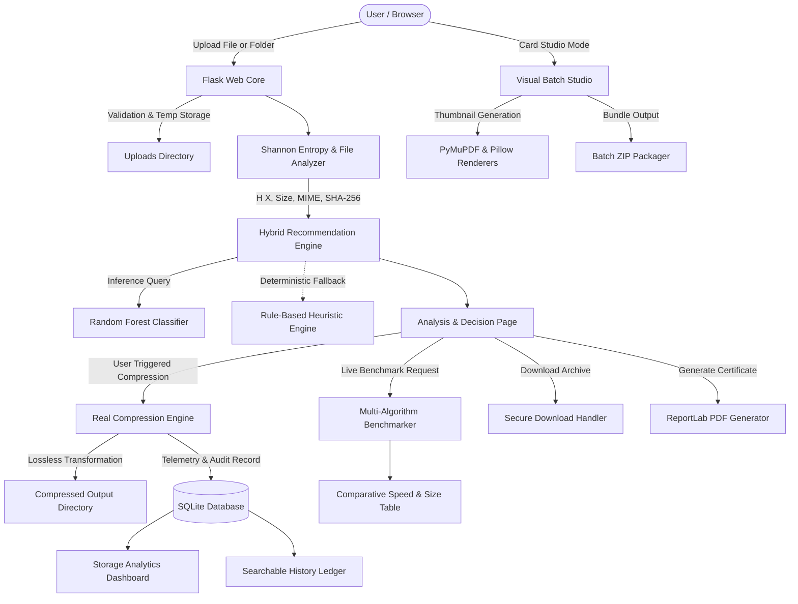

<div align="center">

#  SmartCompress AI

### Intelligent, Entropy-Driven Lossless File & Batch Compression System
*An Information Storage Management (ISM) Academic Research & Production Platform*

[](https://www.python.org/)
[](https://flask.palletsprojects.com/)
[](https://scikit-learn.org/)
[](https://pytest.org/)
[](https://opensource.org/licenses/MIT)
[](https://web.dev/progressive-web-apps/)

<p align="center">
  <a href="#-key-features">Key Features</a> •
  <a href="#-system-architecture">Architecture</a> •
  <a href="#-information-theory--shannon-entropy">Shannon Entropy</a> •
  <a href="#-algorithms-benchmark">Algorithms</a> •
  <a href="#-quickstart--installation">Quickstart</a> •
  <a href="#-visual-batch-studio">Batch Studio</a> •
  <a href="#-api-reference">API Docs</a> •
  <a href="#-viva--exam-defense-guide">Exam Defense</a>
</p>

</div>

---

## Overview & ISM Engineering Context

In enterprise data centers, storage systems are governed by the **Information Storage Management (ISM)** lifecycle. Uncompressed raw datasets consume massive physical capacities in Primary Storage Area Networks (SAN), Network Attached Storage (NAS), and Cloud Object tiers, driving up operational expenses (OPEX) and network transmission latency.

Applying data compression blindly introduces critical engineering bottlenecks:
1. **CPU & Latency Trade-Offs:** Heavy algorithms (e.g., LZMA2, 7Z) require orders of magnitude more CPU cycles and RAM than lightweight options (e.g., Deflate, GZIP).
2. **The High-Entropy Paradox:** Data that is already compressed (e.g., JPEG, MP4, encrypted blocks) exhibits near-maximal Shannon entropy ($\approx 8.0 \text{ bits/byte}$). Compressing such payloads causes **negative space savings** due to container metadata overhead.
3. **Lossless Integrity Mandate:** Enterprise source code, databases, documents, and binaries require **100% mathematical bit-for-bit reconstruction**.

**SmartCompress AI** bridges theoretical information theory and real-world storage engineering. It streams files through a chunked Shannon entropy calculator, feeds empirical file characteristics to a trained **Random Forest Machine Learning model**, determines the optimal compression strategy based on user objectives (`Balanced`, `Fastest`, or `Maximum Compression`), executes real lossless compression across **6 distinct algorithms**, tracks storage savings in SQLite, and generates downloadable **ReportLab PDF audit certifications**.

---

## Notable Features

| Feature | Description |
|---|---|
|  **Empirical Shannon Entropy Engine** | Analyzes byte frequency distribution $H(X) = -\sum p(i)\log_2 p(i)$ via streaming buffers without RAM exhaustion. |
|  **Hybrid ML Decision Architecture** | Random Forest model trained on empirical benchmark runs, with automatic deterministic rule-based fallback. |
|  **6 Real Compression Engines** | Supports **PDF-Deflate, 7Z, ZIP, GZIP, BZIP2, and LZMA** with bit-for-bit integrity verification. |
|  **Visual Card-Based Batch Studio** | Drag-and-drop visual queue with real-time PDF and image thumbnail rendering, intensity sliders, and Batch ZIP downloads. |
|  **Full Folder & Directory Uploads** | Recursive folder processing (`webkitdirectory`), hierarchical entropy aggregation, and archive generation (`.zip`, `.tar.gz`, `.tar.bz2`, `.tar.xz`, `.7z`). |
|  **Live Multi-Algorithm Benchmarking** | Simultaneous race testing measuring compressed sizes, space saved (%), compression durations, and throughput (MB/s). |
|  **Storage Analytics Dashboard** | Real-time Chart.js telemetry tracking cumulative storage reclaimed, algorithm distribution, and savings by file category. |
|  **Archival PDF Technical Reports** | Automated ReportLab PDF generator complete with SHA-256 verification hashes, entropy gauges, and benchmark audits. |
|  **Progressive Web App (PWA)** | Installable desktop/mobile experience with offline caching via Service Worker. |
|  **Enterprise-Grade Security** | Path traversal mitigations (`is_safe_path`), Werkzeug filename scrubbing, and isolated UUID operation namespaces. |

---

##  System Architecture



---

##  Information Theory & Shannon Entropy

Shannon entropy measures the average information density and uncertainty in a discrete random byte stream:

$$H(X) = -\sum_{i=0}^{255} p(x_i) \log_2 p(x_i)$$

Where:
- $X$ is the byte stream of the file.
- $x_i \in [0, 255]$ represents each of the 256 possible byte values.
- $p(x_i) = \frac{\text{count}(x_i)}{\text{total bytes}}$ is the probability of byte $x_i$ occurring.
- $H(X)$ is bounded between $0.0$ and $8.0\text{ bits/byte}$.

### Entropy Interpretation Scale

```
 0.0 bits/byte                                  7.5 bits/byte          8.0 bits/byte
  |---------------------------------------------------|----------------------|
  |     HUGE COMPRESSIBILITY (70% - 95%)              |  INCOMPRESSIBLE      |
  |  Sparse Binaries, Repetitive Logs, Text, Code     |  JPEG, MP4, Encrypted|
```

| Entropy Range | Data Randomness | Typical File Extensions | Compressibility | Optimal Strategy |
|:---:|:---:|:---:|:---:|:---:|
| **0.0 - 3.0** | Extremely Low | `.log`, `.txt`, `.bin`, `.csv` (sparse) | **70% - 95%** | Deflate (ZIP / GZIP), BZIP2 |
| **3.0 - 6.0** | Moderate | `.py`, `.js`, `.html`, `.json`, `.csv` | **50% - 80%** | BZIP2, 7Z, ZIP |
| **6.0 - 7.5** | High | `.pdf`, `.wasm`, `.exe`, `.bmp` | **10% - 30%** | LZMA, 7Z, PDF-Deflate |
| **7.5 - 8.0** | Near-Maximal | `.jpg`, `.mp4`, `.png`, `.zip`, `.gpg` | **< 5% / Negative** | Containerize without heavy CPU |

---

##  Compression Algorithms Matrix

| Algorithm | Foundation | Compression Ratio | CPU Cost | Decompression Speed | Best Suited For |
|:---|:---|:---:|:---:|:---:|:---|
| **PDF-Deflate** | Content Stream & Object Deflation | **High** (30-70% on uncompressed PDFs) | Low | Fast | PDF documents with embedded vector or text streams |
| **ZIP** | Deflate (LZ77 + Huffman) | **Moderate** (50-70%) | Low | Fast | General sharing, multi-platform compatibility |
| **GZIP** | GNU Zip Stream | **Moderate** (50-70%) | Ultra-Low | Fastest | Web streaming, HTTP transfer, system logs |
| **BZIP2** | Burrows-Wheeler Transform + MTF | **High** (60-80%) | Moderate | Moderate | Source code, structured tabular datasets, logs |
| **LZMA** | Lempel-Ziv-Markov chain Algorithm | **Very High** (70-85%) | High | Fast | Operating system packages, kernel images, binaries |
| **7Z** | LZMA2 + Sliding Window | **Maximum** (75-90%) | High | Fast | Long-term archival tiers, cold cloud storage |

---

##  Visual Batch Studio

The **Batch Compression Studio** provides an interactive card-based workflow designed for handling multiple assets simultaneously:

- ** Real Thumbnails:** Renders first-page PDF previews using PyMuPDF and image previews using Pillow.
- ** Compression Level Slider:** Dynamically adjusts compression intensity between 0% and 100%.
- ** Smart Auto-Select:** Automatically assigns the best algorithm per card using the ML predictor or allows manual override.
- ** Single-Click Batch ZIP:** Consolidates all completed files into a single downloaded archive via `/api/download_batch_zip`.

---

##  Quickstart & Installation

### Prerequisites
- **Python:** 3.10 to 3.14 (Verified across Windows, macOS, and Linux)
- **Git**

### 1. Clone the Repository
```bash
git clone https://github.com/SaitamaDaikoku/SmartcompressAI.git
cd SmartcompressAI
```

### 2. Set Up a Virtual Environment

**Windows (PowerShell):**
```powershell
python -m venv .venv
.\.venv\Scripts\Activate.ps1
```

**Windows (Command Prompt):**
```cmd
python -m venv .venv
.\.venv\Scripts\activate.bat
```

**macOS / Linux:**
```bash
python3 -m venv .venv
source .venv/bin/activate
```

### 3. Install Dependencies
```bash
pip install -r requirements.txt
```

### 4. (Optional) Re-Generate Dataset & Retrain Model
The repository includes a ready-to-use pre-trained Random Forest model in `model/saved_model.joblib`. To re-run benchmarks and re-train:
```bash
python dataset/generate_dataset.py
python model/train_model.py
```

### 5. Run the Automated Test Suite
```bash
python -m pytest tests/ -v
```
> **Status:** All **34 unit and integration tests** will execute and pass with 100% green status.

### 6. Launch the Application
```bash
python app.py
```
Open your browser and navigate to **`http://127.0.0.1:5000`**.

---

##  Project Directory Structure

```text
SmartCompressAI/
│
├── app.py                      # Flask main entry point & route controllers
├── config.py                   # Central configuration & runtime paths
├── requirements.txt            # Python package dependencies
├── README.md                   # Comprehensive project documentation
├── .env.example                # Sample environment configuration
├── .gitignore                  # Production gitignore rules
│
├── database/                   # SQLite database access layer
│   ├── __init__.py
│   ├── db.py                   # Parameterized queries, schema & statistics
│   └── database.db             # Auto-initialized SQLite database
│
├── utils/                      # Core mathematical and security utilities
│   ├── __init__.py
│   ├── analyzer.py             # Metadata extraction, categorization & SHA-256
│   ├── entropy.py              # Shannon entropy calculator & interpretation
│   ├── validators.py           # Path traversal protection & file validation
│   └── cleanup.py              # Automated 24h retention cleanup script
│
├── engines/                    # Algorithmic engines
│   ├── __init__.py
│   ├── compression_engine.py   # Lossless engines (ZIP, GZIP, BZIP2, LZMA, 7Z, PDF-Deflate)
│   ├── recommendation_engine.py# Deterministic rule-based recommender
│   └── ml_engine.py            # Hybrid ML decision manager with fallback
│
├── services/                   # Application service layer
│   ├── __init__.py
│   ├── analysis_service.py     # Upload orchestration & state persistence
│   ├── batch_compressor_service.py # Visual multi-file studio, thumbnails & batch ZIP
│   ├── compression_service.py  # Compression execution & live benchmarking
│   ├── history_service.py      # History queries, filtering, pagination & CSV export
│   └── report_service.py       # ReportLab PDF technical report generator
│
├── model/                      # Machine learning artifacts
│   ├── __init__.py
│   ├── train_model.py          # Random Forest training & evaluation script
│   ├── predictor.py            # Model inference & confidence scorer
│   ├── saved_model.joblib      # Serialized trained Random Forest pipeline
│   └── model_metrics.json      # Serialized evaluation metrics & accuracy
│
├── dataset/                    # Empirical training data
│   ├── __init__.py
│   ├── generate_dataset.py     # Empirical benchmark data generator
│   ├── compression_dataset.csv # Compiled training dataset
│   └── raw_benchmark_measurements.csv # Raw experimental runs
│
├── templates/                  # Responsive Jinja2 HTML5 templates
│   ├── base.html               # Master layout, navigation, modals, PWA tags
│   ├── index.html              # Drag-and-drop upload & preference interface
│   ├── result.html             # Analysis, entropy gauge, compress & benchmarks
│   ├── history.html            # Searchable audit ledger with CSV export
│   ├── dashboard.html          # Storage telemetry & Chart.js visualizations
│   └── error.html              # Friendly error & offline fallback template
│
├── static/                     # Web assets
│   ├── css/style.css           # Glassmorphism dark theme & responsive UI
│   ├── js/app.js               # Drag-drop handlers, AJAX benchmarks & PWA
│   ├── manifest.json           # Progressive Web App manifest
│   └── service-worker.js       # PWA offline cache service worker
│
├── uploads/                    # Temporary uploaded files (.gitkeep preserved)
├── compressed/                 # Output compressed archives (.gitkeep preserved)
├── reports/                    # Generated PDF reports (.gitkeep preserved)
└── tests/                      # Automated test suite (34 passing tests)
    ├── __init__.py
    ├── test_analyzer.py        # Entropy formula, edge cases & metadata tests
    ├── test_compression.py     # Roundtrip verification, folders & engines
    ├── test_database.py        # SQLite queries, filtering & statistics
    └── test_routes.py          # Flask routes, batch studio API & benchmarks
```

---

##  API & Route Reference

### Web Routes
| Endpoint | Method | Description |
|---|:---:|---|
| `/` | `GET` | Main upload interface with preference selection |
| `/analyze` | `POST` | Processes uploaded file/folder and generates recommendations |
| `/result/<operation_id>` | `GET` | Results view with entropy gauge, breakdown, and algorithm controls |
| `/compress/<operation_id>` | `POST` | Executes compression using selected or recommended algorithm |
| `/download/<operation_id>` | `GET` | Securely streams the compressed archive file |
| `/download_report/<operation_id>` | `GET` | Generates and downloads the PDF technical audit report |
| `/dashboard` | `GET` | Global storage analytics and visualization graphs |
| `/history` | `GET` | Searchable, paginated audit ledger of all compression events |
| `/export_history` | `GET` | Exports complete history as a CSV file |

### REST & Batch Studio API
| Endpoint | Method | Payload | Description |
|---|:---:|---|---|
| `/api/upload_file` | `POST` | `multipart/form-data` (`files`) | Queues files and returns real rendered thumbnails |
| `/api/compress_file` | `POST` | `JSON` (`operation_id`, `algorithm`, `compression_level`) | Compresses a queued file with specified parameters |
| `/api/download_batch_zip`| `POST` | `JSON` (`{"operation_ids": [...]}`) | Packages queued outputs into a single Batch ZIP |
| `/api/benchmark/<operation_id>` | `POST` | None | Runs empirical multi-algorithm benchmark race |
| `/api/delete_file/<operation_id>` | `DELETE` / `POST` | None | Removes a queued file from the workspace |

---

##  Security Architecture

1. **Path Traversal Protection:** All file reads and downloads strictly validate that the resolved canonical path lies within approved directories (`uploads`, `compressed`, `reports`) using `is_safe_path()`.
2. **Filename Sanitization:** All user-supplied filenames are sanitized through `werkzeug.utils.secure_filename()` with regex fallback to prevent directory escape characters (`..`, `/`, `\`).
3. **UUID Namespace Isolation:** Every file upload and batch job is assigned a cryptographically unique UUID4 (`operation_id`), preventing filename collision and overwrite vulnerabilities.
4. **Code Execution Safeguards:** Files are treated strictly as raw byte streams; no uploaded script or executable is executed on the server.
5. **Automated Lifecycle Purging:** Temporary artifacts can be automatically cleaned using `utils/cleanup.py` or configured via `TEMP_FILE_RETENTION_HOURS` (defaults to 24 hours).

---

##  Testing & Validation

The test suite is built on `pytest` and validates every component of the system:

```bash
# Run the complete test suite
python -m pytest tests/ -v

# Run with coverage report
python -m pytest --cov=. tests/
```

- **`test_analyzer.py`:** Tests discrete Shannon entropy calculation, edge cases (0 bytes, uniform bytes, high-entropy random noise), filename sanitization, and path traversal guards.
- **`test_compression.py`:** Validates roundtrip lossless decompression, SHA-256 hashes, negative space savings detection, and recursive directory archiving across all algorithms.
- **`test_database.py`:** Verifies SQLite transactions, filtering, search, pagination, and dashboard statistics calculations.
- **`test_routes.py`:** Exercises all Flask routes, batch studio endpoints, thumbnail generation, PDF reports, and security protections.

---

##  Contributing

Contributions, bug reports, and suggestions are welcome!

1. Fork the repository
2. Create your feature branch (`git checkout -b feature/AmazingFeature`)
3. Commit your changes (`git commit -m 'Add some AmazingFeature'`)
4. Push to the branch (`git push origin feature/AmazingFeature`)
5. Open a Pull Request

---

## 📄 License & Attribution

Distributed under the **MIT License**. See `LICENSE` for more information.

*Developed as an Information Storage Management (ISM) academic research and production project.*
